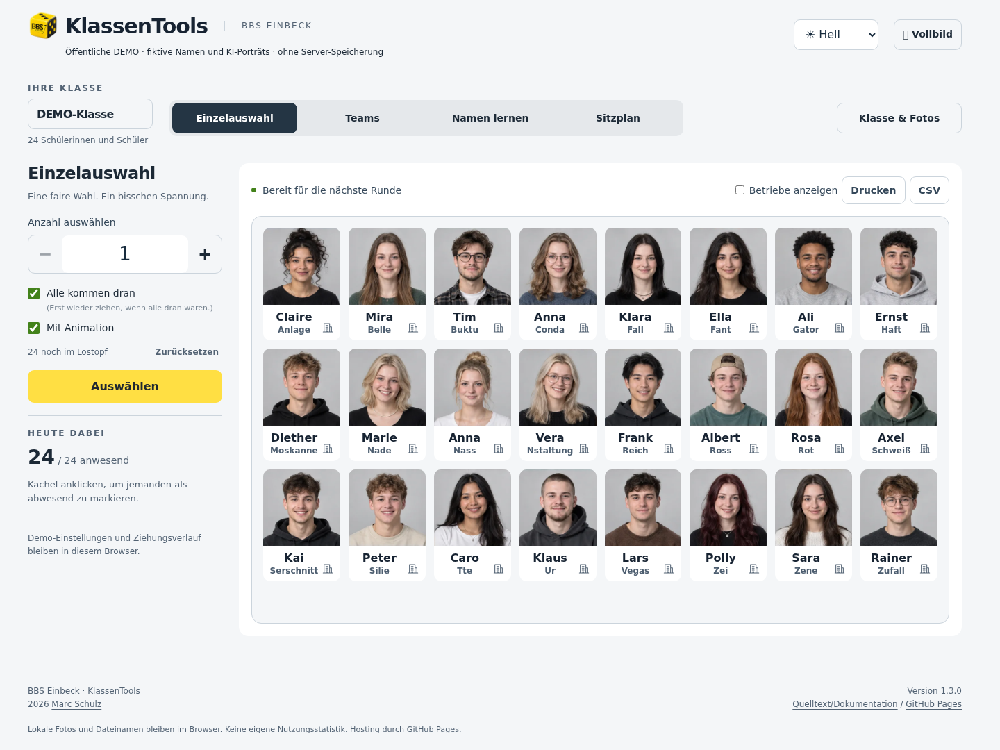
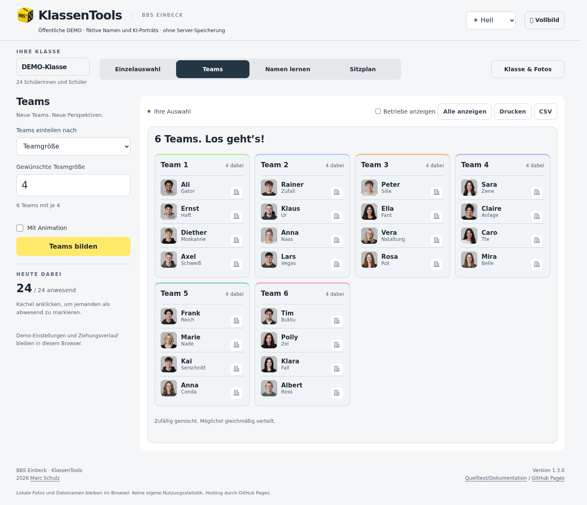
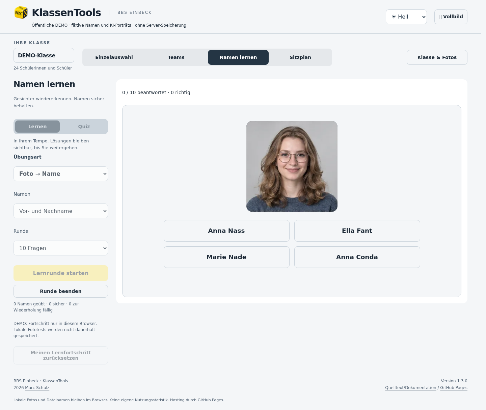
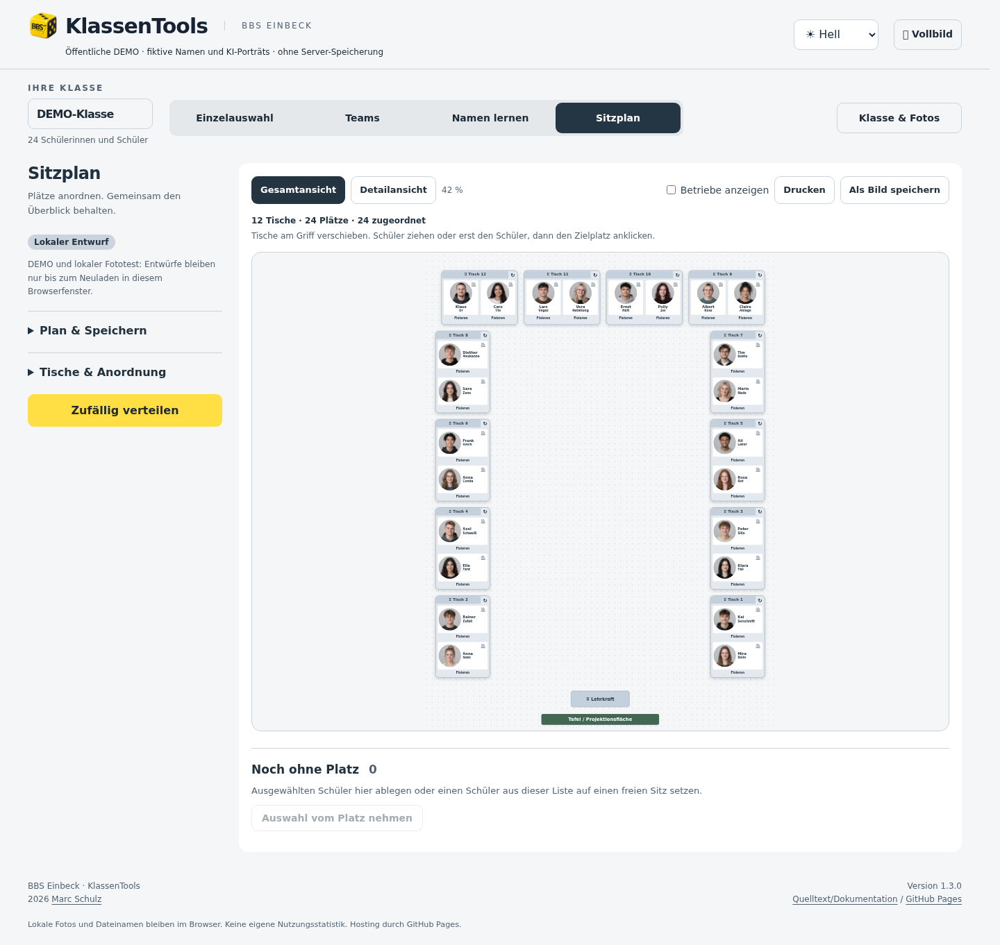

# KlassenTools · BBS Einbeck

[Deutsche Version](README.md) · [Project page & live demo](https://mail896.github.io/bbs_klassentools_public/)

A classroom toolkit for random student selection, team assignment, playful name learning
and visual seating plans. Developed for BBS Einbeck by Marc Schulz. Version **1.3.0**, October 4, 2026.
The interface is German. All demonstration names are fictional and portraits AI-generated.

## Try it

[Open the interactive demo](https://mail896.github.io/bbs_klassentools_public/demo/?demo=1).
No account required. The static demo runs locally in the browser without an application
backend. Local test photos are not uploaded. Seating drafts last until the page reloads.

## Four tools

### 1. Random selection

Draw one or more students, exclude absentees and prevent repetitions until everyone
has had a turn. An optional animation illustrates the draw and shows the selection
probability. Results can be printed or exported as CSV.

### 2. Teams

Split the class by preferred team size or number of groups. Class portraits make
the teams easy to recognize; absent students are excluded. Animate the allocation,
then print the groups or export them as CSV.

### 3. Name learning

Learn at your own pace or take a timed quiz: photo → name, name → photo,
flashcards, typed names and training companies. Quiz answers allow 5 seconds for
name/photo choices, 10 for companies and 20 for typing. Review missed answers
with targeted flashcards. Progress is private; quiz rankings are admin-only.

[All modes, more screenshots and storage rules (German)](docs/LEARNING.md)

### 4. Seating plan

Arrange, rotate and move single or double desks in a U shape or rows. Drag students
between seats, pin places or distribute them randomly. Plans open in detail view;
overview, single-page printing and PNG export support presentation. The server
version stores shared and private plans with named versions.

[Seating details (German)](docs/SEATING.md)

## Across all tools

Light/dark themes, mobile layouts and fullscreen presentation. The server version
adds IServ classes, shared photos, training companies, class approvals and audit history.

## Install and test

Requires Node.js 24, npm and Python 3. See [installation guide](docs/INSTALLATION.en.md).
Browser tests use Playwright and synthetic data; protected functionality requires your
own IServ clients and server deployment. Example hosts and network ranges are placeholders.
The supplied deployment profile is not a universal installer.

## Source and security

public/ contains frontend code and assets; backend/ contains OIDC, authorization and
storage; tests/ contains synthetic tests; site/ contains the GitHub project page.
Pages publishes only the static site and demo, never backend/configuration files.
This is a sanitized source snapshot with a new public history.

[Security reporting](SECURITY.md) · [MIT license](LICENSE) · [Branding and assets](docs/ASSETS.md).
Copyright (c) 2026 Marc Schulz. Included school branding does not authorize others
to represent BBS Einbeck. This release is not a security certification or proof of
successful installation on every target environment.
