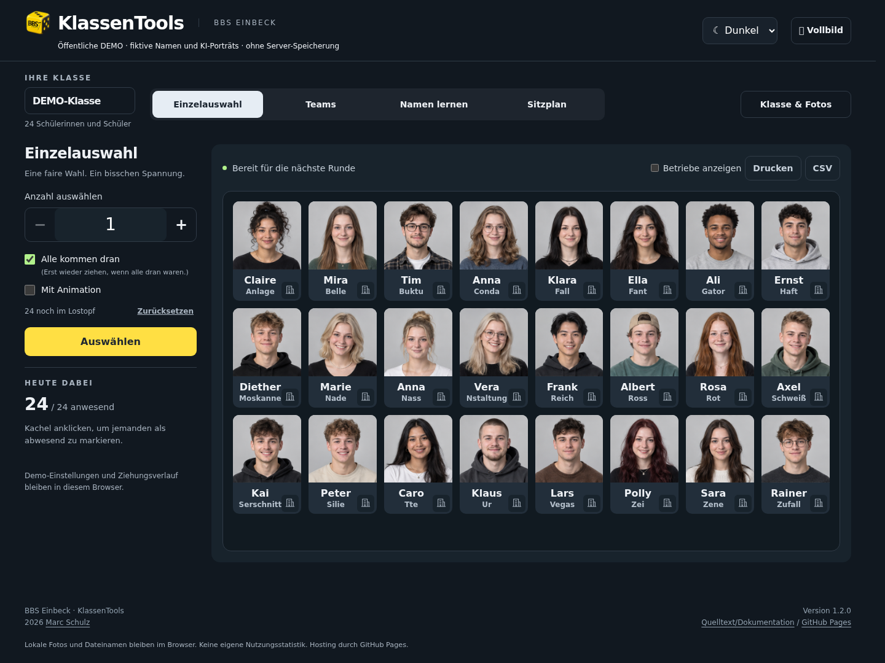
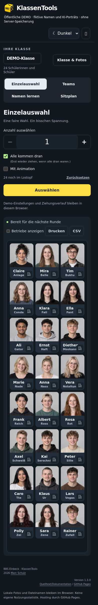

# KlassenTools · BBS Einbeck

[English version](README.en.md) · [Projektseite & Demo](https://mail896.github.io/bbs_klassentools_public/)

Eine Klasse. Viele Möglichkeiten. KlassenTools unterstützt Lehrkräfte bei der
Zufallsauswahl, Teamaufteilung, spielerischen Lernen der Schülernamen und
Gestalten von Sitzplänen – anschaulich mit Fotos und einer Portion Spannung.

## Stand

- Version **1.2.11**, 3. Oktober 2026.
- Verantwortlich: **Marc Schulz · BBS Einbeck**.
- Öffentlicher, bereinigter Quellstand mit eigener Historie und MIT-Lizenz.
- Screenshots und Demo verwenden ausschließlich erfundene Namen und KI-Porträts.

## Direkt ausprobieren

**[Zur spielbaren DEMO →](https://mail896.github.io/bbs_klassentools_public/demo/?demo=1)**

Keine Anmeldung nötig. Einzelauswahl, Teams, Namen lernen und Sitzplan laufen im Browser.
Lokale Testfotos werden nicht hochgeladen. Sitzplanentwürfe sind in der öffentlichen
Demo nur bis zum Neuladen verfügbar. Dauerhaft gespeicherte Klassen gehören zur
separat installierten, geschützten Serverversion.

## Die vier Funktionen

### 1. Einzelauswahl

Eine oder mehrere Personen zufällig auswählen, Abwesende ausnehmen und mit
„Alle kommen dran“ Wiederholungen vermeiden. Eine Animation macht die Ziehung
sichtbar; die Auswahlwahrscheinlichkeit wird angezeigt. Ergebnisse lassen sich
drucken oder als CSV exportieren.


### 2. Teams

Die Klasse nach gewünschter Teamgröße oder Anzahl der Gruppen aufteilen.
Klassenfotos machen die Teams übersichtlich; Abwesende bleiben unberücksichtigt.
Die Verteilung kann animiert werden. Fertige Gruppen lassen sich drucken oder
als CSV mitnehmen.


### 3. Namen lernen

Gesichter und Namen in fünf Modi üben: Foto → Name, Name → Foto, Karteikarten,
Namenseingabe und Ausbildungsbetrieb. Zur Wahl stehen zehn Fragen, die ganze
Klasse, Zeitrunden und freies Üben. Unsichere Namen werden gezielt wiederholt;
Rückmeldungen und Ergebnisübersicht zeigen den Fortschritt. Die Serverversion speichert ihn
pro IServ-Konto; in der DEMO bleibt er im Browser. Highscores sieht nur die Administration.


[Alle Lernmodi, weitere Screenshots und Speicherregeln](docs/LEARNING.md)

### 4. Sitzplan

Einzel- und Zweiertische in U-Form oder Reihen anordnen, drehen und verschieben.
Schüler per Drag-and-drop umsetzen, Plätze fixieren oder zufällig verteilen.
Der Einstieg zeigt die Detailansicht; die Gesamtansicht, einseitiger Druck und
PNG-Export helfen beim Präsentieren. Die Serverversion speichert gemeinsame und
private Pläne mit benannten Versionen.


[Mehr zum Sitzplan](docs/SEATING.md)

## Gemeinsam in allen Bereichen

Helle/dunkle Darstellung, mobile Bedienung und Vollbild. Die Serverversion ergänzt
IServ-Klassen, gemeinsame Klassenfotos, Ausbildungsbetriebe, Klassenfreigaben und
den administrativen Änderungsverlauf.

<details><summary>Dunkle und mobile Ansicht</summary>





</details>

## Installation

Node.js 24, npm und Python 3:

```sh
npm ci --ignore-scripts
npm ci --prefix backend --ignore-scripts
npm run check
npm run pages:build
python3 -m http.server --bind 127.0.0.1 --directory dist/pages 8080
```

[Installation und Tests](docs/INSTALLATION.md) · [English installation](docs/INSTALLATION.en.md)

GitHub Pages benötigt kein Backend. Die IServ-Version benötigt eine eigene
administrativ eingerichtete Serverumgebung. Die Beispielendpunkte school.example
und Netze sind Platzhalter; das Deploymentprofil ist noch kein Universalinstaller.

## Aufbau

- public/: Oberfläche, Fachlogik und lokale Bilder.
- backend/: IServ/OIDC, Rechte, Foto-/Sitzplanspeicherung und Audit.
- tests/: synthetische Fach-, Berechtigungs- und Browsertests.
- deployment/: bereinigtes Beispielprofil für Apache/systemd.
- site/: GitHub-Projektseite; scripts/build-pages.py erstellt nur öffentliche Artefakte.
- docs/: [Architektur](docs/ARCHITEKTUR.md), [Datenmodell](docs/DATENMODELL.md),
  [Sitzplan](docs/SEATING.md), [Namen lernen](docs/LEARNING.md), [Abhängigkeiten](docs/DEPENDENCIES.md).

## Sicherheit und Lizenz

Keine Zugangsdaten, echten Klassenlisten, Fotos oder lokale Entwicklungshistorie
im öffentlichen Repository. GitHub Pages enthält weder Backend noch Konfiguration.
[Sicherheitsmeldungen](SECURITY.md) · [MIT-Lizenz](LICENSE) · [Bilder und Schulzeichen](docs/ASSETS.md)

Die Veröffentlichung ist kein Nachweis einer vollständigen technischen oder
organisatorischen Abnahme für eine beliebige neue Serverinstallation.
