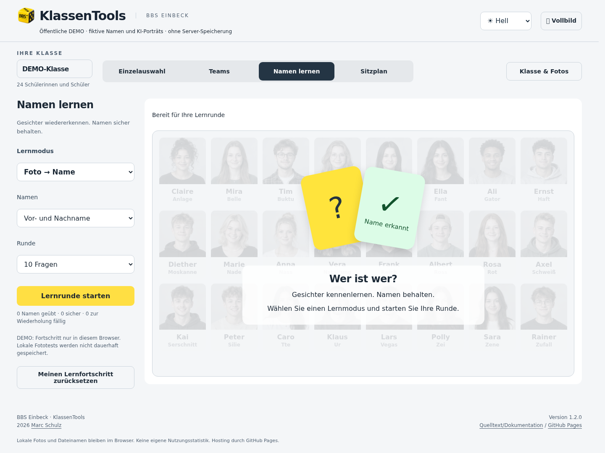
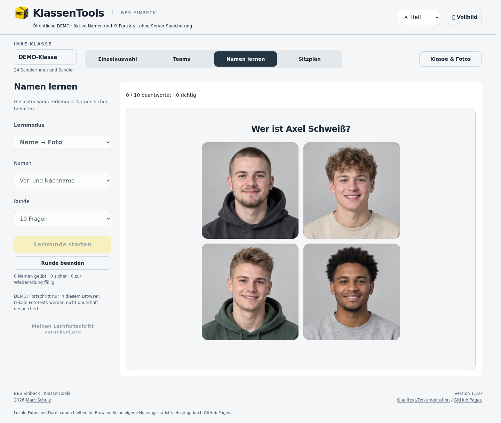
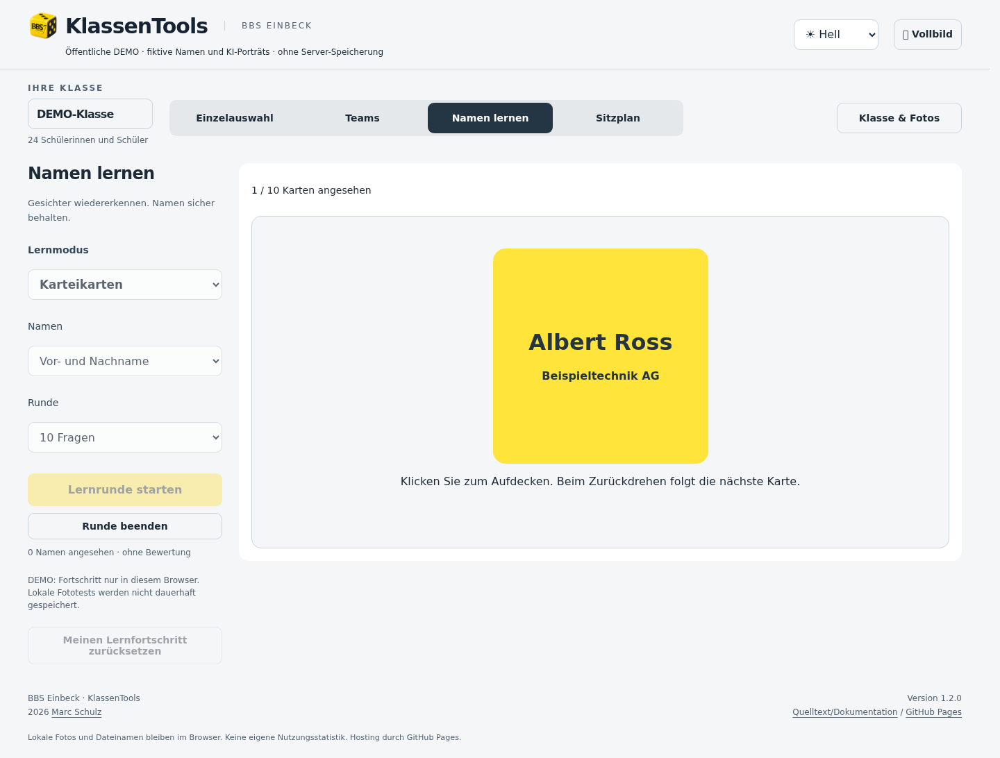
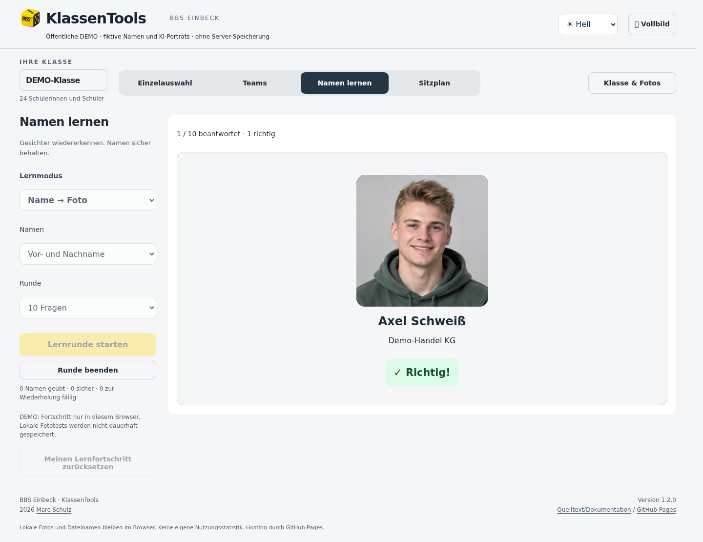
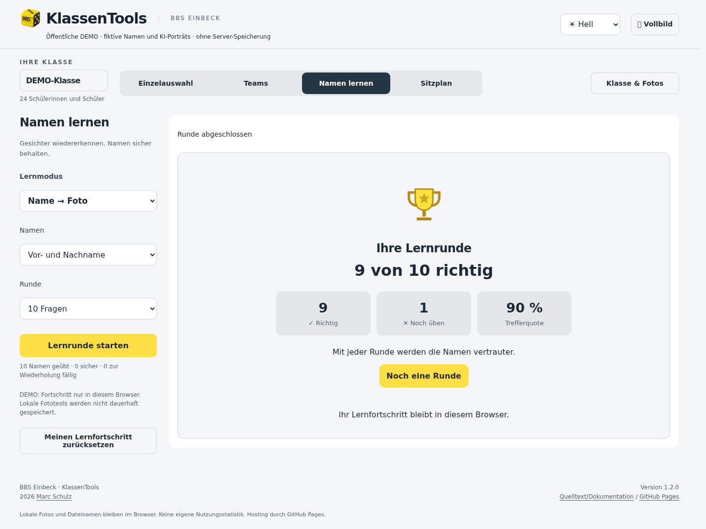

# Namen lernen und Ausbildungsbetriebe

„Namen lernen“ ist der dritte Hauptbereich, zwischen Teams und Sitzplan. Bestehende Fotos werden
wiederverwendet; keine Gesichtserkennung und kein zusätzlicher externer Dienst.

## Lernrunden

- Foto → Name und Name → Foto: bis zu vier Antwortmöglichkeiten, bei kleinen
  Klassen entsprechend weniger. Gleiche Vornamen werden vollständig angezeigt.
  Die fiktive DEMO verwendet feste Antwortgruppen, damit Alternativen nicht durch
  gemischte männliche/weibliche Namen zu leicht werden. Reale Klassen bleiben ohne
  solche Gruppierung: keine Geschlechtsableitung aus Namen oder Fotos.
- Namen eingeben: Groß-/Kleinschreibung, Trennzeichen und Akzente werden normalisiert.
  Ein einzelner Tippfehler ist ab fünf Zeichen zulässig, sofern er nicht mit einem
  anderen Namen verwechselt werden kann. Vollständig identische Namen bleiben
  fachlich mehrdeutig; passende gleichnamige Antworten werden akzeptiert.
- Karteikarten: per Klick umdrehen, Name auf der Rückseite. Angesehene Karten werden
  ohne Selbstbewertung, Trefferquote oder Highscore gezählt.
- Ausbildungsbetrieb: Foto dem hinterlegten Betrieb zuordnen. In der Demo sind
  Betriebsnamen ebenfalls fiktiv. Bis zu vier unterschiedliche Antworten aus
  vorhandenen Betrieben; auf dem Server ergänzt der aktive Katalog die Betriebe
  der Klasse. Lokale Fototests haben keine Betriebsdaten.
- 10 Fragen, ganze Klasse, 60 Sekunden oder freies Üben (maximal 200 Fragen).
  Bei „Ganze Klasse“ wird jede verfügbare Person einmal gezeigt.

Es zählen alle Klassenmitglieder mit Foto, unabhängig von der Anwesenheitsmarkierung
für die Zufallsauswahl. Ohne Foto bzw. ohne benötigte Betriebszuordnung wird eine
Person ausgelassen. Zunächst kommt jede verfügbare Person einmal vor. Erst danach
werden Namen wiederholt. Falsche Antworten erhöhen die Auswahlwahrscheinlichkeit.
Richtige Antworten verlängern das Wiederholungsintervall auf 1, 2, 4, 8, 16 bzw.
30 Tage. Falsche Antworten sind nach zwei Minuten erneut fällig. Fälligkeit ist
zusätzliche Gewichtung, keine Sperre bis zu diesem Zeitpunkt. Die letzten zwei
Personen werden nach Möglichkeit nicht unmittelbar wiederholt.

Quizantworten bleiben zwei Sekunden sichtbar, dann geht es automatisch weiter.
In Sekundenrunden pausiert die Uhr serverseitig während dieser festen Rückmeldung.
Highscores unterscheiden aktive Zeit und frühere Zeitwertung. Karteikarten
wechseln nach dem manuellen Zurückdrehen automatisch weiter.

## Fortschritt und Highscore

Angemeldete Lehrkräfte: nach jeder Antwort serverseitig pro Konto, Klasse,
Mitglied, Lernmodus und Namensumfang. Andere Lehrkräfte erhalten keinen Zugriff
auf diesen individuellen Fortschritt. Zurücksetzen löscht nur den eigenen Stand
und laufende Runden. Die bereits protokollierten Runden bleiben bis zur Löschfrist.

Administration → Lernen & Betriebsverlauf: abgeschlossene Runden, explizit
beendete Teilrunden und Betriebsänderungen. Highscores ausschließlich hier,
serverseitig administrativ geschützt. Je Lehrkraft wird das beste Ergebnis pro
Klasse, Modus, Namensumfang, Rundentyp und Größe des Personenpools angezeigt.
Für Zeitrunden zählen zuerst richtige Antworten, dann Trefferquote; sonst zuerst
Trefferquote, dann richtige Antworten. Bei Gleichstand entscheidet die kürzere
Dauer. Karteikarten, freie und vorzeitig beendete Runden haben keinen Highscore.
Ranglisten beziehen sich auf die bis zu 500 angezeigten, gefilterten Ereignisse.

Die Regeln werden bei IServ-Runden auf dem Server ausgewertet. Wiederholte
Antwortanfragen zählen nicht doppelt; fremde Runden können nicht verändert werden.
Dennoch sind dies Trainingsergebnisse, keine Prüfungs- oder Leistungsnachweise:
Die Klassenliste mit Namen ist bereits für diese Lehrkräfte zugänglich.

Anonyme Demo: Fortschritt in `klassentools.learning.demo.v1` im LocalStorage.
Keine Übertragung von Demo-Ergebnissen an das Backend. Lokale Fototests bleiben
im Arbeitsspeicher und speichern weder Namen noch Bilder noch Lernfortschritt
dauerhaft. Ein Browserneuladen beendet die aktuelle Runde; gespeicherter
IServ-Fortschritt bleibt bestehen. Verlassen ohne „Runde beenden“ erzeugt keinen
Highscore, bereits bestätigte Antworten bleiben erhalten.

## Ausbildungsbetriebe

Administration → Ausbildungsbetriebe: Name, optional Ort/Kurzbezeichnung, aktiv
oder inaktiv. Maximal 2000 Einträge; gleiche Namen am gleichen Ort werden vermieden.
„Klasse & Fotos“ → Ausbildungsbetriebe: einzelne oder markierte Schüler einem
Betrieb zuordnen. Speicherung gilt für berechtigte Lehrkräfte dieser Klasse.
Inaktive Betriebe bleiben bei bestehenden Zuordnungen sichtbar, können aber
nicht neu zugewiesen werden. Eine leere Zuordnung entfernt den Betrieb.

Die Mitgliedschaft wird aus IServ geprüft; Unternehmenszuordnungen kommen nicht
aus IServ. Gleichzeitige Änderungen werden über Revisionen erkannt und verlangen
Neuladen statt stillen Überschreibens. Änderung und Audit sind eine Transaktion.

## Speicherung, Lebensdauer und Update

Fünf additive Tabellen in der bereits geschützten Fotos-SQLite, außerhalb Webroot:
`companies`, `company_assignments`, `learning_progress`, `learning_rounds`,
`learning_audit`. Keine neue Datenbank, Laufzeitabhängigkeit oder Netzfreigabe.

- Fortschritt: Zähler, Erfolgsserie und nächste Wiederholung; keine Antworttexte.
  Bleibt bis zum persönlichen Zurücksetzen bzw. administrativer Datenbereinigung.
- Aktive Runden: eine pro Lehrkraft/Klasse, maximal 24 Stunden. Enthalten einen
  Namens-/Betriebssnapshot, keine Bildkopien. Neue Runde ersetzt die vorige.
- Lernprotokoll und Zurücksetzungen: 90 Tage. Bereinigung beim Start, Abruf und
  über den bestehenden Minuten-Takt des Backends, kein neuer Systemdienst.
- Betriebskatalog, Zuordnungen und deren Änderungsaudit bleiben erhalten wie der
  bisherige fachliche Änderungsverlauf. Aufbewahrung organisatorisch festlegen.

Tabellenanlage ist wiederholbar; Foto-/Sitzplandaten werden nicht geändert.
Die Tabellen gehören zum gemeinsamen Datenbestand und müssen bei Sicherung und
Wiederherstellung zusammen mit Fotos, Sitzplänen und Zuordnungen berücksichtigt werden.

Tests: `tests/learning.test.mjs` (Regeln, SQLite, Isolation, CSRF, Rollen),
`tests/learning-flow.mjs` (Browser mit echtem lokalen API-Backend und synthetischen
Daten, Speicherung/Neuladen, Betriebsverwaltung, alle Demomodi, Mobilansicht).

Betriebe können administrativ revisionsgesichert gelöscht werden. Dabei werden
Zuordnungen in allen Klassen atomar entfernt und deren Revisionen erhöht.
Löschung und betroffene Zuordnungen bleiben im Audit nachvollziehbar. Laufende
Lernrunden behalten ihren begonnenen Datenstand; neue Runden nutzen den Katalog.

## Bilder aus der fiktiven DEMO

### Einstieg mit der aktuellen Klasse als Hintergrund

### Name → Foto

### Karteikarte und Rückmeldung

### Rundenabschluss

## Betriebsinformationen in den Klassenansichten

Bei zugeordnetem Betrieb öffnet das Gebäudesymbol eine Infobox mit vollständigem
Namen und Ort – per Maus, Tastaturfokus oder Antippen. Die eigene Schaltfläche
ändert weder Anwesenheit noch Sitzplatz. „Betriebe anzeigen“ blendet zusätzlich
Kurzbezeichnungen ein (ersatzweise den Namen); die Einstellung gilt auch für
Druck und Sitzplan-PNG und ist zunächst ausgeschaltet. Sie bleibt nur in der
aktuellen Ansichtssitzung erhalten. In Lernfragen bleibt der Betrieb verborgen,
bis die Lösung erscheint; bei Karteikarten steht er auf der Rückseite.

Unter „Klasse & Fotos“ liefert die Betriebssuche direkte Treffer nach Name,
Ort oder Kurzbezeichnung. Treffer auswählen, Schüler markieren und
„Auf Markierte anwenden“ nutzen; erst „Betriebszuordnungen speichern“ übernimmt
die Änderungen dauerhaft. Enter im Suchfeld schließt den Dialog nicht. Nach
erfolgreichem Speichern schließt er mit einer grünen Bestätigung.

### Foto und Betrieb gemeinsam bearbeiten

Unter „Klasse & Fotos“ öffnet „Anpassen“ den Dialog „Foto & Betrieb“ für die gewählte Person. Die vorhandene Betriebszuordnung ist vorausgewählt; die Suche filtert nach Name, Ort oder Kurzbezeichnung. „Kein Betrieb zugeordnet“ entfernt die Zuordnung. Die Bildausschnittregler lassen sich bei Bedarf aufklappen.

„Änderungen speichern“ speichert nur geänderte Angaben, schließt den Dialog und bestätigt grün. Eine reine Betriebsänderung schreibt das Foto nicht erneut. Neue Fotos können nach der Personenzuordnung ebenfalls einzeln mit Betrieb gespeichert werden; weitere Fotos bleiben zur Prüfung offen. Bei einem Teilerfolg bleibt der Dialog offen und zeigt, was bereits gespeichert wurde. Die bestehende Sammelzuordnung bleibt verfügbar.
